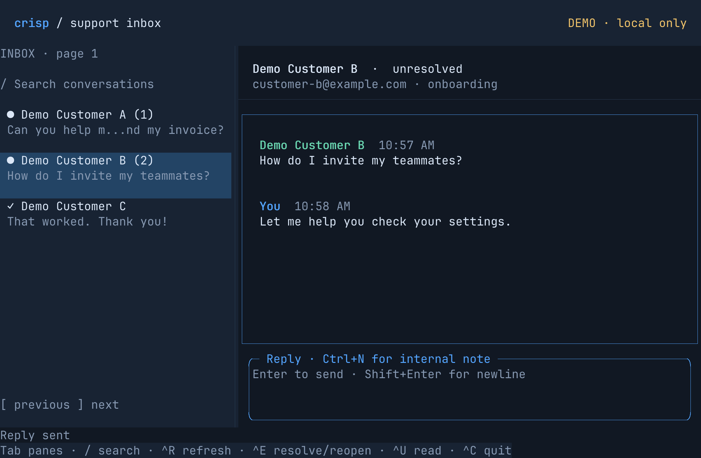

# termshot

Turn raw terminal output (a PTY log with ANSI escapes) into a PNG of the final screen.
Headless: no window, no terminal, no crates.io dependencies. The same source builds
on macOS and Linux and writes the same pixels.

termshot reads bytes a terminal already emitted, rebuilds the cell grid, and paints it.
The screenshot below is 2200×1440.



## When to use it

We built it for TUI work, where the thing to check is what the screen ends up showing:

- **Developing a TUI.** Record what the app writes, render it, and look at the frame without
  opening a terminal. This also works on a remote box or inside an agent loop.
- **Verifying output.** Same bytes in, same PNG out. Commit a reference image and compare
  against it in CI to catch layout, color, or box-drawing regressions.
- **Screenshots for docs, READMEs, and PRs.** You get a crisp image at any pixel height. It
  doesn't depend on your terminal theme, font, or window size.
- **Bug reports.** Ask for the raw log, not a phone photo of the screen, and render it at your
  end.

It draws one final frame, not an animation. The screen model follows xterm and covers:

- autowrap, scrolling, scroll regions, inserting and deleting lines, and the alternate screen
  that full-screen programs use (`vi`, `less`)
- cursor movement, tabs, erase, inserting and deleting characters, saving the cursor, and DEC
  line drawing (`ESC ( 0`)
- the cursor, drawn where the log leaves it, unless the log hides it (`ESC [ ? 25 l`): a block
  in reverse video, or the underline or bar a program picks with DECSCUSR (`ESC [ 5 SP q`, as
  shells in vi mode and editors do for insert mode), drawn steady

`tests/vt/` checks this against tmux, on short cases and on recorded `ls`, `less` and `vi`
sessions. A bare LF moves down without returning to column 0, as in a terminal; logs captured
through a PTY already have CR LF. For output that has bare LFs (a text file, `cmd > out.log`),
pass `--lf-newline`.

Colors are the 16 and 256 color palettes (xterm's defaults) and 24-bit color, in the `;` and
`:` forms. Bold, dim, italic, underline, double underline, strike-through, reverse video and
hidden text are drawn; blink is not. Italic is the font's own glyph slanted by 12 degrees, and
box drawing stays upright in it. Wide characters (CJK, fullwidth forms, emoji) take two
cells. A combining mark is kept only when Unicode has a precomposed form for it; other marks are
dropped ([#14](https://github.com/momiji-rs/termshot/issues/14)).

## Speed

The latest comparison uses main at `c44d83c` (including Unicode support and
the native test harnesses) and the current optimizations. These are whole CLI runs, including startup, input, font validation,
parsing, rendering, encoding, file close, and exit.

| Workload | Batch A: main → optimized (median ms) | Batch B: main → optimized (median ms) |
| --- | ---: | ---: |
| reply-sent | 9.09 → 8.66 | 9.35 → 8.97 |
| ascii-overflow | 17.02 → 6.34 | 16.56 → 6.10 |
| ansi-replay | 21.11 → 20.13 | 20.42 → 19.31 |
| large | 43.36 → 39.98 | 41.57 → 38.11 |
| unicode | 9.71 → 7.84 | 9.23 → 7.52 |

Apple M3, 24 GiB RAM, macOS 26.3.1, measured 2026-10-01. Each batch uses five
warmups and 40 interleaved runs per binary/workload, with different ordering seeds.
The benchmarks use the explicit external font. All 15 workloads produce
byte-identical PNGs. Stage profiling, child CPU time,
and peak RSS are measured as well; both batches retain every sample and p95.

This round reduces work in ASCII scrolling, CSI parsing, glyph caching,
and DEFLATE matching/emission. It also releases input storage before rendering.
Small-case gains and tail latencies vary; the shared-machine measurements do not
establish a universal millisecond figure. The
[current baseline](docs/performance.md#current-baseline-font-paths-and-linux-2026-10-03-d83c8fd)
(2026-10-03, `d83c8fd`) remeasures all of these on an Apple M2 Max and on
Linux x86-64, and adds the built-in font, CJK fallback fonts, mixed scripts and
glyph working sets beyond the cache.

See [performance measurements](docs/performance.md) for all cases, paired
confidence intervals, memory tradeoffs, rejected experiments, remaining
bottlenecks, reproduction, and the origin of the historical “~20 ms” claim.

## Build


A C compiler and rustc 1.70 or newer are enough.

```sh
./build.sh
```

The binary links libc and libm.

## Test

```sh
./test.sh
```

This builds termshot, runs the parser unit tests, checks box drawing (`tests/boxes.c`) and glyph placement (`tests/glyphs.c`: wide characters, missing glyphs), checks the CLI exit codes, and compares the rendered samples against `tests/goldens.txt`. The goldens hash decoded pixels (stb_image decodes them, `tests/golden.rs` hashes them), so a change to how the PNG is encoded doesn't break them; only a change to the pixels does. They cover the two samples at px 46 and 48 and the edge cases in `tests/fixtures/` (clipping, missing glyphs, escapes, random colors, box drawing from px 1 to 255), and CI runs them on Linux and macOS. px 46 is there because it is a size where a compiler that fuses multiply-adds would render different pixels.

When a change is meant to move pixels, look at the renders in `target/test/`, then run `./test.sh --update-goldens`. `SANITIZE=1 ./test.sh` builds draw.c with ASan and UBSan; this works on macOS only.

A test for a known bug describes the correct behaviour and is marked `#[ignore = "#N: ..."]` with its issue. None are open now. Run them with `./target/test/unit --ignored`. The other ignored test, `poc_workloads`, writes inputs for `bench/c-vs-rust/` and checks nothing.

## Run

```sh
./termshot examples/reply-sent.pty reply-sent.png
```

The binary carries JetBrains Mono, so it needs no other files. The grid defaults to 100×30
and the font pixel height to 48. Give the size the capture used:

```sh
./termshot --size 120x40 session.pty session.png
./termshot --px 24 --font path/to/font.ttf session.pty session.png
cat session.pty | ./termshot - - > screen.png   # stdin to stdout
./termshot --fallback-font /path/to/cjk.ttf session.pty session.png
```

To screenshot a TUI that is still running, drive it in tmux and capture the pane. tmux ends
each row with a bare LF, so pass `--lf-newline` and the pane's size. The capture doesn't say
where the cursor is, so ask tmux and pass it with `--cursor`:

```sh
tmux new-session -d -s app -x 100 -y 30 top
cursor=$(tmux display -p -t app '#{?cursor_flag,#{cursor_x}#,#{cursor_y},none}')
tmux capture-pane -t app -e -p | ./termshot --lf-newline --size 100x30 --cursor "$cursor" - top.png
```

To check what a screen shows rather than how it looks (in a test, or as an agent), write it as
text. It is laid out as `tmux capture-pane -p` prints it: a line per row, trailing spaces
trimmed. For logs without graphics, omitting the PNG skips font loading and takes about
a tenth of the time. Kitty graphics still need font metrics to replay cursor movement,
even for text/JSON-only output; images themselves are not included in these formats:

```sh
./termshot --text - session.pty | grep -q 'Saved'        # text only, to stdout
./termshot --text screen.txt session.pty screen.png     # both
```

`--json` adds the colours, the attributes and the cursor. Each row is a line of runs of cells
that look alike, with the column each starts at (a wide character takes two):

```json
{"cols":100,"rows":30,"cursor":{"col":2,"row":5,"shape":"block"},"lines":[
[{"col":0,"text":"ok","fg":"#00cd00","bg":"#111823","bold":true},{"col":2,"text":" done","fg":"#dbe7f7","bg":"#111823"}],
...
]}
```

`cursor` is null when the log hides it; its `shape` is `block`, `underline` or `bar`. `bold`, `italic`, `underline`, `double_underline` and `strike`
appear only when set. Blank cells that end a row are left out unless their background or a line
shows. Colours are as drawn: reverse video and dim are already applied, and concealed text has
`fg` equal to `bg`.

| option | |
|---|---|
| `-f`, `--font FILE` | TrueType or OpenType (CFF or CFF2) font (default: built-in JetBrains Mono); `FILE#N` or `FILE#NAME` picks a face of a collection |
| `--fallback-font FILE` | TrueType or OpenType (CFF or CFF2) font for characters the first lacks, such as CJK; faces as for `--font` |
| `-p`, `--px N` | font pixel height, above 0 and below 256 (default 48) |
| `-s`, `--size CxR` | grid columns × rows, up to 500×200 (default 100x30) |
| `--lf-newline` | treat each bare LF as CR LF, for logs not captured through a PTY; a final bare LF ends the last line instead of scrolling |
| `--cursor COL,ROW` or `none` | draw the cursor there, counting from 0 as tmux's `#{cursor_x},#{cursor_y}` do, or not at all (default: where the log leaves it, unless it hides it) |
| `--cursor-shape block`, `underline` or `bar` | draw the cursor as that shape (default: the one the log sets with DECSCUSR, or a block) |
| `--text FILE` | write the screen as text, a line per row with trailing spaces trimmed; the PNG is then optional |
| `--json FILE` | write the screen as JSON: the cursor and its shape, and per row the runs of cells alike in colour and attributes; the PNG is then optional |
| `-v`, `--verbose` | print the cell and image size to stderr |
| `-h`, `--help`, `-V`, `--version` | |

It prints nothing on success, except a hint on stderr when the log has line feeds but no CR,
which means it was probably not captured through a PTY and needs `--lf-newline`, and a warning
when a font maps a character to an empty glyph, so it was drawn as a box. The warning names the
first such cell, the font, and what to pass instead. Exit status is 0 when done; 1 when a file can't be read or written,
or the font is unusable; and 2 for bad arguments, including an image over 2^27 pixels. termshot
won't write a PNG to a terminal, and only one output can be `-`. A failed run removes the output
files it created.

The original form, `termshot <log> <out.png> <font.ttf> [px] [cols] [rows]`, still works.

`M` is snapped to a whole number of pixels so box-drawing joints meet. All box drawing and block elements (U+2500–U+259F: light, heavy, double and dashed lines, corners, tees, arcs, diagonals, eighths, shades and quadrants) are painted as geometry inside their cell, so lines join with any neighbour at any size; `tests/boxes.c` checks every one against its Unicode name. Other characters come from the font, then from `--fallback-font`, which is sized to the same height and centered in the cell; a character neither has is drawn as an outlined box, except for spaces, the line and paragraph separators, and the blank Braille pattern U+2800. Wide characters (CJK, fullwidth forms, emoji, by Unicode 17 widths) take two cells and are centered over both (on a one-column screen, where no row can hold two, they take the one cell); a combining mark merges into the character before it when Unicode has the precomposed form (e + U+0301 is é) and is otherwise dropped. An SGR reset uses foreground `#dbe7f7` on background `#111823`.

The font may have TrueType (`glyf`), CFF or CFF2 outlines, so `.ttf`, `.otf` and collections such as Noto Sans CJK's `.ttc` all work. A variable font with CFF2 outlines (such as `NotoSansCJKtc-VF.otf`) is drawn at its default instance, which for Noto Sans CJK is the Thin weight; choosing another instance is not supported yet. Color emoji fonts are bitmaps, not outlines, so emoji need a monochrome outline font such as Noto Emoji. A glyph with no outline counts as missing, so the emoji of a color font that has `glyf` (Apple Color Emoji) go on to `--fallback-font` or are drawn as boxes rather than left blank, with a warning. stb_truetype trusts the file it reads, so termshot first checks every structure stb will use (`src/font.rs`), and runs CFF and CFF2 charstrings itself (`src/cff.rs`), with a limit on the work a glyph may take; stb only rasterizes the outline. A damaged or hostile font is refused with a reason, and the run exits 1.

A font collection (`.ttc`) holds several faces, often one per script or region, and termshot
draws with one. Pick it after a `#`: `FILE#3` by number, counting from 0 as
`fc-list : file index family` does, or `"FILE#Family Name"` by its full or family name, ignoring
case. Without a `#`, the first face is used and a hint on stderr lists the others; `FILE#0`
uses the first without the hint. A face that doesn't exist, or a name that two faces share, is
refused with the list (exit 1), and `-v` prints the face used. If the file's own name has a
`#` in it, it is read as that file.

## Images in PTY logs

Kitty graphics sent inline (`t=d`) render above the text: RGB (`f=24`),
RGBA (`f=32`, the default), and PNG (`f=100`), including `m=1`/`m=0` chunks
and zlib-compressed payloads (`o=z`; a compressed PNG gives its size in `S`).
`a=T` transmits and places an image; `a=t` only stores it, under an id `i` or
a number `I`, and each `a=p` places a stored one again, sharing its pixels.
Images start at the cursor, use their native pixel size or fit a `c`/`r` cell
rectangle while preserving aspect ratio, and blend alpha over the existing
screen. Scaling uses deterministic nearest-neighbor sampling. Cell dimensions
come from the selected font and `--px`. `C=1` keeps the cursor in place;
otherwise it advances by the placement's columns and rows, clamped to the
screen/scroll area's bottom and right edges.

A placement id `p` names one placement of an image: putting the same `i,p`
again moves it. Deletes follow kitty's selectors: all (`d=a`, the default), by
id (`i`, with `p`), by number (`n`), by id range (`r`), at the cursor (`c`), at
a cell (`p`, `q` with a z-index), in a column (`x`), a row (`y`), or by z-index
(`z`). Lowercase keeps the image data for another `a=p`; uppercase also frees
the images it leaves without a placement. Retransmitting an id replaces its
image and removes its placements. Nonnegative `z` orders overlays, then the
order images and placements were made. Only images wholly inside a scrolling
region move and clip at its edges; images crossing a margin stay stationary.
Full-screen erase and reset remove every placement and free every stored image,
as kitty does. Explicit image ids and numbers must be nonzero; omitting `i` is
valid. Main and alternate screens keep separate images. See
[the regression evidence](docs/kitty-graphics.md).

This is a subset, not full kitty emulation: file/shared-memory transfer,
source cropping, pixel offsets, negative z-index, animation, relative placements and Unicode
placeholders are not supported. Unsupported or malformed commands are ignored
without printing their payload. PNG images may be compressed internally as usual.
The log must contain the original escape sequences and image bytes; a plain
`tmux capture-pane` text capture cannot recover them. This does not make every
image-using TUI capture compatible automatically. Advanced kitty work is
tracked in [#44](https://github.com/momiji-rs/termshot/issues/44).

Sixel images (`ESC P P1;P2;P3 q … ESC \`) are drawn too, following xterm's
decoder (its `graphics_sixel.c`, patch 412) and the VT340 it emulates:

- Colour introducers `#Pc` select a register and `#Pc;Pu;Px;Py;Pz` define it,
  in HLS (`Pu` 1, DEC hues: 0 is blue, 120 red, 240 green) or RGB (`Pu` 2), in
  percent, rounded half up to 8 bits. Each image has its own 1,024 registers,
  starting from the VT340's 16 colours (the rest black), as xterm's default
  private colour registers; register numbers wrap at 1,024. Drawing starts in
  register 3, as in xterm. Pixels keep their register, so redefining one
  recolours what it drew: the palette at the end of the image applies.
  A definition out of range or with the wrong number of parameters is ignored.
- Repeats (`!Pn`), graphics carriage return (`$`) and next line (`-`), and raster
  attributes (`"Pan;Pad;Ph;Pv`). Pixels are square device pixels at their
  native size, as in xterm, which also ignores `P1` and `Pan;Pad`; cell
  dimensions come from the font and `--px`, as for kitty's native sizing.
  The image is as large as `Ph`x`Pv` or its pixels reach, whichever is larger.
- `P2` 1 leaves pixels no sixel set transparent. `P2` 0 or 2 paints the declared
  area with register 0, as xterm does; pixels past it stay transparent.
- With Sixel scrolling on (the default), the image starts at the cursor, and
  the cursor ends on the last text row the image covers, in the same column,
  so the program's next newline goes below it. An image that would pass the
  bottom margin first scrolls the region up; its top is cut off if it is
  taller than the region. DECSDM (`CSI ? 80 h`) instead draws at the top left
  corner, clipped at the bottom, without scrolling or moving the cursor.
- The image joins the kitty image store as an unnamed image drawn above the
  text, so it shares the layering, scrolling, erase and storage limits above.
  Only `ESC \` commits an image; BEL, CAN, SUB, another escape or the end of
  the log discard it, and C1 controls (such as the 8-bit ST) are not
  recognised. A DCS that is not Sixel (`DECRQSS`, `XTGETTCAP`, ...) is
  skipped. An image wider or taller than 8,192 pixels or over 4,194,304
  pixels is refused whole, before its pixels are allocated, and a repeat
  costs nothing beyond those bounds. Since a few bytes can declare a large
  image or draw over the same pixels again and again, a log may write at most
  16,777,216 Sixel pixels plus 256 for each byte of Sixel data, counting every
  pixel a sixel sets, each time it sets it, and every pixel of each finished
  image; an image past that budget is refused.

Text written later where an image is stays under it. Erasing below or above
the cursor (ED 0 or 1) leaves images in place, where xterm erases their pixels.
An image with no pixels moves nothing. Non-square pixels from `P1` or `Pan;Pad`
(xterm ignores them too), DECSET 8452 (the cursor to the right of the image),
shared colour registers (`CSI ? 1070 l`) and ReGIS are not supported.

Limits per screen are 1,024 placements, and 4,096 stored images holding 16 MiB
of RGBA pixels. Past the image limits, an upload first frees every image
without a placement, then the least recently placed ones, as kitty's storage
quota does; a placement past its limit is discarded. Each upload is limited to 16 MiB of decoded payload and 8,192 pixels per source
axis (at most 4,194,304 source pixels). A display rectangle is limited to
16,777,216 pixels per axis. The PNG decoder has a separate 64 MiB allocation
budget, including inflation. A compressed (`o=z`) RGB or RGBA payload may be
at most 1,024 bytes over its decoded size, as in kitty; a compressed PNG at
most 16 MiB. Over-limit commands are discarded.

## Samples

`examples/reply-sent.pty` and `examples/draft-ready.pty` are captures from the [crisp-tui](https://github.com/solcreek/crisp-tui) demo inbox. The customers and messages are fake. At pixel height 48 the image is 2200×1440.

## Measure and test

```sh
TERMSHOT_PROFILE=1 ./termshot examples/reply-sent.pty /tmp/reply.png \
  third_party/jetbrains-mono/JetBrainsMono-Regular.ttf
python3 scripts/bench.py --binary current=./termshot --runs 40 \
  --output /tmp/termshot-bench.json
SANITIZE=1 ./tests/run.sh
```

Profiling writes two `termshot-profile` JSON records to stderr, covering input,
parsing, font allocation/reading/validation/padding (for the built-in or given
font and the fallback alike), glyph cache and fallback counters, drawing, PNG filtering, compression
allocation/matching/emission/checksum, PNG packaging, and writing. The benchmark
interleaves ordinary and profiled CLI runs in the same rounds, plus optional
peak RSS and (on Linux) cold-cache runs; it records raw samples, means, medians,
p95, child CPU time, paired comparisons, profiling overhead, output size and
hash, and host, toolchain, source and font details. Each font-path case checks
the profile counters that show it took its path (`scripts/bench-report.py`
summarizes a result file). Python 3 is needed only for optional
development scripts (benchmarks and CRC table generation); the tests need only
a C compiler and rustc.

See [performance measurements](docs/performance.md) for the before/after results,
baseline reproduction, timing boundaries, and remaining bottlenecks. Extended
pixel tests retain main's reference images and portable floating-point settings.

See [CHANGELOG.md](CHANGELOG.md) for notable changes.

## Vendored files

The program is MIT. Three things next to it keep their own terms:

- `third_party/stb/` is [stb](https://github.com/nothings/stb) `stb_truetype.h` 1.26 and `stb_image_write.h` 1.16, public domain. `stb_image.h` 2.30 decodes inline PNG images and test output; production enables only in-memory PNG decoding with bounded allocations. Local writer hooks and fixes are documented in [CHANGES.md](third_party/stb/CHANGES.md).
- `third_party/jetbrains-mono/` is JetBrains Mono Regular, [SIL Open Font License 1.1](third_party/jetbrains-mono/OFL.txt).
- `third_party/noto-sans-cjk/` is a subset of Noto Sans CJK TC, used only by the tests, [SIL Open Font License 1.1](third_party/noto-sans-cjk/OFL.txt).
