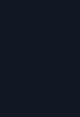
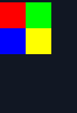
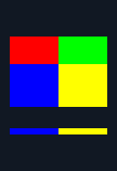

# Kitty direct graphics: issue #41

The report is reproducible on `d65b1af`: `replay` passes APC and DCS to
`skip_string`, so a valid inline image produces only the background. Existing
string-skipping tests check that these payloads do not leak into text, but do
not assert image pixels. They remain valid and pass with the new image layer.

These are actual CLI outputs for the same committed 2×2 RGB fixture, with
`c=4,r=2`, a 6×4 screen, `--px 48`, and `--cursor none`:

| Before (`d65b1af`) | After |
| --- | --- |
|  |  |

```sh
./termshot --cursor none --size 6x4 --px 48 \
  tests/fixtures/kitty-rgb.pty /tmp/kitty.png
```

The [kitty protocol](https://sw.kovidgoyal.net/kitty/graphics-protocol/)
requires preserving image aspect ratio when fitting a cell rectangle. With
this font, 4×2 cells are 88×96 pixels: the square image is 88×88 with four pixels
of empty space above and below. Stretching to cover the entire rectangle would
not follow that rule. The renderer uses integer nearest-neighbor sampling for
cross-platform reproducibility; it does not promise GPU-filter-identical output.

## Validation and reproduction

Local validation passed on Linux x86-64:

- `RUSTUP_TOOLCHAIN=1.70.0 ./test.sh`: 132 unit tests passed; one existing
  benchmark helper is ignored. All CLI, pixel, codec and geometry checks passed.
- `SANITIZE=1 UBSAN_OPTIONS=halt_on_error=1 ./tests/run.sh`: passed, including
  the image decoder/compositor, codec round trips and concurrent render checks.

`./test.sh` runs the complete suite, including:

- Parser/state tests: RGB/RGBA, chunks and final-chunk cursor position, native
  and cell sizing, cursor policy, deletion/replacement, z order, scrolling and
  clipping, alternate screens, resets, malformed input and resource limits.
- `tests/graphics.rs`: explicit expected RGBA pixels for RGB, RGBA, PNG and
  PNG-with-alpha at five pixel heights (1, 9, 24, 47.5, 128): **843,072 pixel
  checks**, plus native clipping, text layering, transparency and deletion.
  Expected colors and geometry are computed independently of production code.
- Six new decoded-pixel goldens; all 20 existing hashes stay unchanged.
- `tests/image.c`: production PNG decoding, every truncation of a valid PNG,
  2,000 deterministic byte mutations, quota exhaustion and recovery, and
  allocation accounting. The Rust tests also decode PNGs concurrently.

After a test build, run the same pixel assertions against a pre-fix binary:

```sh
target/test/graphics /path/to/termshot-before
```

The baseline fails with:

```text
assertion `left == right` failed: rgb px=1 at (0,0)
  left: [17, 24, 35]
 right: [255, 0, 0]
```

`SANITIZE=1 UBSAN_OPTIONS=halt_on_error=1 ./tests/run.sh` additionally checks the
production image decoder and C image compositor under AddressSanitizer and
UndefinedBehaviorSanitizer. CI runs the pixel suite on Linux x86-64, Linux
arm64 and macOS, and tests Rust 1.70 compatibility.

## Scope

This implements the issue's first stage, direct `a=T` transmission, with an
independent image layer. The PNG decoder reuses vendored stb and adds no
external library dependency. Sixel remains deferred. See the README's supported
subset before using this to test a TUI: external-file transfers and
animation remain unsupported (Unicode placeholders came with #44; see
[Unicode placeholders](#unicode-placeholders)). Separate transmit and put came
with #44; see [Stored images and placements](#stored-images-and-placements).
It has not been validated against captures of AgentAmp or yazi, or compared
pixel-for-pixel with a live kitty terminal.


## Scroll margins and explicit IDs

[Protocol review](https://github.com/momiji-rs/termshot/pull/43#pullrequestreview-5398124081)
was verified against the [kitty specification's terminal interactions](https://sw.kovidgoyal.net/kitty/graphics-protocol/#interaction-with-other-terminal-actions).
A placement crossing either margin stays stationary as a whole. Only placements
entirely inside the region scroll; clipping at an edge is permanent, including
when scrolling reverses. Eligibility uses the remaining visible bounds.

| Before (`5090104`): image split into bands | After: whole crossing image stays stationary |
| --- | --- |
|  |  |

```sh
./termshot --cursor none --size 12x8 --px 24 \
  tests/fixtures/kitty-scroll.pty /tmp/kitty-scroll.png
```

The corrected unit tests fail on `5090104`: scrolling a placement spanning
pixel rows 20–80 through a region starting at 40 incorrectly leaves only 20–40.
The end-to-end oracle also rejects that binary. Fourteen full-raster comparisons
cover crossing and contained placements, both directions, region clearing,
IL/DL and IND/RI. Unit tests cover each margin separately, both margins together,
exact-edge containment, reverse scrolling without resurrection, deletion and
replacement at the quota limit, plus 2,000 modeled scroll operations. Only the
`kitty-scroll` PNG golden changes; the other 25 PNG hashes and all text/JSON
goldens remain unchanged.

The [image-ID rule](https://sw.kovidgoyal.net/kitty/graphics-protocol/#querying-support-and-available-transmission-mediums)
requires supplied IDs to be nonzero. Tests reject `i=0`, `i=000` and overflow,
without placing an image, advancing the cursor or leaking payload into text;
omission, `i=1` and `i=4294967295` remain valid. The zero-ID test fails on
`5090104` before the parser fix.

Remaining protocol work: Sixel is already tracked by #41; advanced kitty
features now have a dedicated follow-up, #44.


## Stored images and placements

The first stage of #44 separates stored images from their placements, with
the semantics taken from kitty's `docs/graphics-protocol.rst` and
`kitty/graphics.c` (master, read 2026-10-02) rather than from the earlier
`a=T`-only code:

- `a=t` stores an image, `a=p` places a stored one at the cursor, and `a=T`
  does both. Placements share the image's pixels (`Rc`), so putting one image
  many times costs no pixel copies. `a=t` with neither `i` nor `I` stores
  nothing, as kitty trims such an image at once.
- `I` names the newest image with that number. Such an image gets the lowest
  free id (kitty's `get_free_client_id`). Giving both `i` and `I` is ignored.
- `(i, p)` with a nonzero `p` names one placement; putting it again moves it.
  `p` is ignored on an image without an id.
- Retransmitting an id removes the old image and its placements as the
  transmission starts, so a failed retransmission leaves nothing to place.
- Draw order is kitty's: z-index, then image creation, then placement
  creation. The earlier code broke ties by image id, which kitty does not.
- Delete selectors `a i n r c p q x y z` follow `handle_delete_command` and
  `filter_refs`: lowercase removes placements and frees only images without
  an id; uppercase also frees the images it emptied. `d=I`/`d=N` without `p`
  and `d=R` also free matching images that already had no placement; `d=A`
  keeps stored images it did not touch. Cell selectors use the cells each
  placement covers, which follow scrolling and are clipped at the margins as
  kitty's `scroll_filter_margins_func` clips them. `f` (frames) is ignored.
- ED 2, RIS and entering the alternate screen act as `grman_clear`: every
  placement goes and every image left without one is freed, stored ones too.
- Over 16 MiB or 4,096 images, an upload frees every image without a
  placement (except itself), then the least recently placed, with their
  placements, as `apply_storage_quota` does. The image count limit is
  termshot's: it bounds the linear lookups. kitty's own quota is 320 MB.

`src/graphics/tests.rs` covers each selector in both cases against a fixed
scene, freeing of stored images, the quota order, numbers, placement moves,
retransmission and scrolled cell bounds. Seventeen hand-made mutants of this
logic all fail the tests. `tests/graphics.rs` checks one full raster with two
stored images put in seven cells: draw order by z-index and creation, a moved
placement and a delete by column, against pixels it computes itself.


## Compressed payloads

`o=z` follows kitty's `inflate_zlib` and `initialize_load_data` (master, read
2026-10-03). The payload, after base64 and chunking, is an RFC 1950 zlib
stream that must inflate to exactly the data's size: `w*h*3` or `w*h*4` for
raw pixels, and for PNG the `S` key, or 100 KiB without it, as kitty assumes.
Any other `o` is ignored, as kitty refuses it. `S` changes nothing on an
uncompressed transmission.

The inflater is stb_image's, already built into `src/image.c` for PNG, so
nothing new is vendored. `image_inflate` adds what kitty gets from zlib and
stb skips: the Adler-32 trailer, the window field (at most 32 KiB) and the
exact output size; bytes after the trailer are ignored, as zlib ignores them.
It finds the trailer from the bits stb has buffered, and the caller pads the
input with 8 zero bytes so that read-ahead stays in the buffer. The output is
the image buffer itself, sized before inflating and limited to 16 MiB, so a
stream cannot allocate more than its size promises.

`tests/image.c`, also run under ASan and UBSan, round-trips noise, runs and
mixtures up to 70,000 bytes through the renderer's compressor, and checks
sizes one short and one long, trailing bytes, every change to the trailer,
truncations, the window and dictionary fields, and 2,000 mutations. It
includes data whose Adler-32 has a zero low half, where the zero padding
matches a trailer cut short, so only the bounds checks can refuse it.
`src/graphics/tests.rs` checks each format, `S`, the 100 KiB default, chunks
and the 16 MiB limit at its edge. `tests/graphics.rs` renders the four
fixture images again from `tests/fixtures/kitty-*-z.pty`, compressed by
Python's zlib, against the same expected pixels. Ten hand-made mutants of
the checks all fail the tests.


### Payload cap and early checks

kitty sizes a direct upload's buffer at the decoded size plus 1,024 bytes
for a compressed one (`initialize_load_data`) and refuses an RGB or RGBA
payload that would overflow it (`load_image_data`, `EFBIG`); only PNG may
grow. termshot applies the same cap to compressed RGB and RGBA, over all the
chunks of an upload and checked as each arrives, so an oversized upload is
dropped before it is fully buffered. An uncompressed RGB or RGBA buffer gets
10 bytes over the decoded size, and kitty uses the first `w*h*3` or `w*h*4`
bytes of what arrives (`process_image_data`), so termshot accepts a payload
up to 10 bytes longer than the decoded size and ignores the excess (#55). It used to require the
exact size. A PNG, compressed or not, keeps the 16 MiB
payload limit. Raw dimensions are checked against the decoded limits (8,192
pixels per axis, 16 MiB of RGBA) before inflating, so a stream for an image
that would be refused anyway is never inflated.

`src/graphics/tests.rs` sends RGB and RGBA payloads one byte short, exact,
and 1, 10 and 11 bytes long, alone and with the excess in different chunks.
`src/graphics/zlib_tests.rs` checks the cap at 1,024, 1,027, 1,028 and 1,029
bytes, alone and chunked; a stream cut at every chunk size, for stored and
Huffman-coded streams; interrupted uploads; that bytes after the trailer are
ignored; the early dimension checks; and 100,000 or 16 MiB of zeros sent for
smaller, near and exact images. `tests/image.c` inflates a hand-built
104 KiB fixed-Huffman stream of 16,908,289 zeros into heap buffers of exactly
12 bytes, 16 MiB, and the exact size and one either side under ASan, and
inflates with the allocation quota spent. `kitty-rgb-z-chunks.pty` is
termshot's own compression of `kitty-rgb`'s pixels (made by `src/deflate.c`; `src/deflate.rs` writes the same bytes), cut across three
chunks inside the DEFLATE data. Goldens for it and the four `-z` fixtures hash
the same as the uncompressed renders; the existing goldens are unchanged.


## Crops, offsets and layers

The third stage of #44 follows the spec's "Controlling displayed image
layout" section and kitty's `handle_put_command`, `update_dest_rect`,
`grman_update_layers`, `shaders.c` and `background.slang` (master, read
2026-10-03):

- **Crop.** `x, y, w, h` (0 meaning the rest of the image) are intersected
  with the image, as `handle_put_command` clamps them. A crop starting past
  the image is empty: the put draws nothing, but still replaces the
  placement it names and moves the cursor past the cells `c`, `r` and the
  offset span. termshot does not keep an empty placement, which kitty does;
  only the delete selectors and the storage quota could tell them apart.
- **Offsets.** `X, Y` move the image inside its first cell. The spec says
  they must be smaller than the cell; kitty clamps them to a pixel short of
  its edge, and so does termshot. `c` and `r` still count cells from the
  cell's edge, so an offset shrinks the space they give (the spec: "it is not
  added to the number of rows/columns"; kitty's destination rectangle ends at
  the `c`-th column's edge).
- **Aspect ratio.** The crop's, not the image's. With one of `c` and `r`, the
  other side follows it; with both, the crop is fitted inside and centered,
  as the spec's "letterboxed/pillarboxed" says. (kitty's own code fills the
  rectangle for an ordinary placement and letterboxes only Unicode-placeholder
  ones; termshot keeps the spec's rule, as it did before this stage.)
- **Cells covered** run from the cell to the far edge of that space. kitty
  computes the width for an `r`-only placement from `r` rows *plus* the
  vertical offset, which is not the width it draws; termshot uses the drawn
  extent. This changes the cursor only when `r`, no `c` and `Y` are given.
- **Layers.** kitty draws the default background, then images with `z` below
  `INT32_MIN / 2` (-1,073,741,824), then the cell backgrounds that are not the
  default, then other negative `z`, then the text and cursor shapes, then
  `z >= 0`. A background is the default one when its colour *value* is the
  default background (`cell_has_default_bg` compares colours), except for
  reverse video, the block cursor and selections, which kitty makes opaque.
  termshot marks reverse-video cells and the cells under the block cursor
  with a new `Cell` bit, `ATTR_OPAQUE` (128, in both languages). Before
  drawing, `opaque_backgrounds` in `main.rs` sets it on every other
  background not in the default colour, so `draw.c` needs no copy of
  `DEFAULT_BG`; it paints the lowest layer only over the cells left clear. The block cursor
  is a background in kitty, so an image with a negative `z` above
  -1,073,741,824 covers it, and only the cursor's text colour stays on top.
- **Shades.** U+2591–2593 now blend their colour over what is painted, not
  over the cell's background colour, so an image under the text shows
  through them as through a glyph. Without such an image the pixels are the
  same, and every existing golden hash is unchanged.
- The bar and underline cursors are drawn with the text, as kitty draws them
  in its cell foreground pass (`cell.slang`): over the images under the text,
  under `z >= 0`. Until the follow-up to this stage they were above every image.

Tests: `src/graphics/geometry_tests.rs` covers crops in and past each edge,
empty crops, offsets at and past the cell size, offsets with `c`, `r` and
both, the crop's aspect ratio, the signed `z` parser at its limits, draw and
delete order by negative `z`, moving a placement with new geometry, scrolling
and clipping an offset image, and extreme cell metrics. `tests/draw.c`, also
under ASan and UBSan, checks the layer boundaries, the clear-background mask
and crop sampling in `paint_images`. `tests/graphics.rs` checks every pixel
against rasters it builds from the rules above: a crop scene at px 9, 24 and
47.5, plain and scrolled, and the six layer boundaries (`z` = -2^31,
-2^30 - 1, -2^30, -1, 0, 7) over a row of text, a red, a default-valued and
a reverse-video background and a shade, opaque and half transparent, with no
cursor, a block and a bar, at px 9, 24 and 47.5 (292,896 pixel checks). The
crop checks fail against `origin/main`. `kitty-crop` and `kitty-layers` add
four goldens; the existing goldens are unchanged.


## Relative placements

This stage of #44 follows the spec's "Relative placements" section and
kitty's `handle_put_command`, `has_good_ancestry`, `resolve_parent_offset`
and `grman_update_layers` in `kitty/graphics.c`, and
`parse-graphics-command.h` (master, read 2026-10-03):

- **Keys.** `P` (parent image id) and `Q` (its placement id) are unsigned,
  `H` and `V` (cells right and down) signed 32-bit integers, as kitty parses
  them. `P=0` is no parent; `Q`, `H` and `V` without `P` do nothing.
- **Parent.** The image with id `P`, and its placement `Q`. Without `Q`,
  kitty takes the first placement in its hash map, which is no order a client
  can rely on; termshot takes the oldest, by creation, which a move keeps.
- **Refusals.** A put is refused, changing nothing and leaving the cursor
  where it is, when no image has id `P`, it has no placements, or none with
  id `Q` (kitty's `ENOPARENT`); when the placement would be its own parent
  (`EINVAL`) or ancestor (`ECYCLE`), which only putting an existing placement
  again can do; or when the chain from it to its root would have more than 8
  links (`ETOODEEP`, kitty's `PARENT_DEPTH_LIMIT`; the spec asks for at least
  8). A refused move leaves the placement where it was. kitty makes a new
  placement before checking its chain, so a new one refused as too deep
  still marks its image used for the storage quota; termshot does the same.
- **Position.** The root's start cell plus the `H` and `V` of every link on
  the way; the positions of the placements in between do not count. The
  child's own `X`, `Y`, `c`, `r`, crop and `z` apply as for any placement.
  A child may lie partly or wholly off the screen; it is kept, and drawn
  clipped to the screen when its parent brings it back.
- **Cursor.** It never moves after a relative put, whatever `C` says (the
  spec's note; kitty moves it only in the branch for a placement without a
  parent). Text and JSON output therefore need no font for such a put.
- **Lifetime.** kitty drops a placement whose chain no longer resolves (a
  parent gone, or a chain made too long) when it next lays out its images,
  and then frees its image if it has no placements left, whatever its id: the
  spec's "if the image … has no more placements, the image is deleted as
  well". termshot does this after every command and scroll, so every way a
  parent can go takes its children: each delete selector, in either case,
  retransmitting the parent's image, the storage quota, an empty crop put on
  it (termshot keeps no empty placements; kitty does, and they can be
  parents), ED 2, RIS, and scrolling off. The images the delete itself hit
  keep the lowercase and uppercase rules.
- **Moves.** Putting a parent again moves its whole group. Putting a child
  again with a new `P` re-parents it, with its own children; without `P` it
  becomes an ordinary placement at the cursor, which moves again. Moving a
  placement under a deeper chain can make its descendants too deep: as in
  kitty, they go.
- **Scrolling.** A child does not scroll on its own; it follows its root's
  start row. In a full-screen scroll that row goes above the screen, as
  kitty's goes into its scrollback, so the children keep moving with the
  part of the root still shown. In a partial region kitty stops the start
  row at the top margin when the margin clips the root, so its children stop
  there too; termshot does the same. Once the root leaves the screen or the
  region it is removed, as before, and its children with it.

Where termshot differs from kitty, deliberately:

- kitty keeps a root that scrolls off a full screen in its scrollback, where
  its children can still reach the screen. termshot keeps no scrollback, so
  they go with the root.
- kitty sets a child's own start cell to the cursor at its put, never draws
  from it, but uses it for the cell delete selectors (`c`, `p`, `q`, `x`,
  `y`) and for scrolling a region, where it can clip or remove the child by
  rows it is not drawn in. termshot uses the cells the child is drawn in for
  both, and clips children only at the screen's edges.
- A virtual (`U=1`) parent is placed from its placeholder cells; see
  [Unicode placeholders](#unicode-placeholders).

Every relative placement counts toward the 1,024-placement limit. Layout is
linear in the placements: each child keeps its parent's index, checked
against its key, so scrolling 1,024 placements costs no lookups. Each walk
up a chain stops at a placement already resolved, and marks the ones it
passes, so a cycle, which the checks above prevent, is found rather than
followed. Depth is counted on the way back down, where each placement's own
is known: a placement passed on the walk up from one too deep may itself be
fine ([review](https://github.com/momiji-rs/termshot/pull/63#discussion_r4175211540)).

Tests: `src/graphics/relative_tests.rs` covers the keys at their limits,
offsets with `X`, `Y` and `c`, the cursor with and without `C`, `Q` and the
oldest placement, each missing-parent case with an existing placement named,
chains at 8 and 9 links, new and moved (with the too-deep descendants laid
out before their ancestors too), cycles of one, two and three, every
delete selector in both cases against a three-level family with the images
it frees, retransmission, the quota, empty crops, full-screen and partial
scrolling, off-screen children, `z` order, and 1,024 placements in chains
re-parented under each other; eleven of twelve hand-made mutants fail them,
and the twelfth (scrolling children before laying them out) is equivalent.
`tests/graphics.rs` checks every pixel at px 9, 24 and 47.5 for a chain of
three, a corner-clipped child and a put after them (in the parent's cell,
since the cursor stayed), still, with the parent moved, scrolled, its child
deleted and itself deleted (325,440 checks); they fail on `origin/main`.
`kitty-relative` adds two goldens; the existing goldens are unchanged.


## Unicode placeholders

This stage of #44 follows the spec's "Unicode placeholders" section and
kitty's `screen_render_line_graphics` and `color_to_id` in `kitty/screen.c`,
`grman_put_cell_image`, `handle_put_command`, `resolve_parent_offset` and
the delete and clear filters in `kitty/graphics.c`, and `font_for_cell` in
`kitty/fonts.c` (master at `9939c7b`, read 2026-10-03):

- **Virtual placements.** `U` is any number; nonzero makes the put virtual,
  as `a=p` or `a=T`. It is stored with its `c` and `r`, is never drawn, and
  never moves the cursor. It counts toward the placement limit and keeps its
  image stored. A virtual put with `P` is refused (kitty's `EINVAL`). Putting
  the same `i,p` again with or without `U=1` turns one kind into the other.
- **Ids from colours.** kitty's `color_to_id` keeps its colour's value: 0 for
  the default, `n` for palette colour `n` (SGR 30-37 and 90-97 are 0-15),
  and 0xRRGGBB for a 24-bit colour. The cell stores resolved RGB, so the pen
  now also keeps these two numbers, for the foreground and for the underline
  colour (SGR 58/59, colon and semicolon forms). Printing U+10EEEE records
  them in a side table parallel to the cells, like the marks of #14, kept in
  step by the same edits (overwrite, erase, ICH, DCH, scrolling, the
  alternate screen). `Cell` is unchanged. The underline colour is not drawn;
  termshot still draws underlines in the foreground colour.
- **Diacritics.** The first, second and third marks of the cell are the row,
  the column and the high byte of the image id, each the index in
  `rowcolumn-diacritics.txt` (`src/rowcolumn_diacritics.rs`, generated by
  `tools/rowcolumn-diacritics.sh` from kitty's file at `9939c7b`, 297
  entries). Any other mark counts as none. The id is the foreground's id
  with `(high - 1) << 24`, truncated to 32 bits as kitty's shift is.
- **Inheritance.** Exactly kitty's runs: a cell continues the run to its
  left when its foreground and underline ids match and each diacritic it has
  agrees (the same row, the next column, the same high byte), and takes what
  it lacks from it. Any other cell starts a run at row 0, column 0, high
  byte 0 where it has none. Every row is scanned left to right.
- **Scaling.** As `grman_put_cell_image`: the whole image, whatever the
  virtual placement's crop, offsets or `z`, is fitted into `c x r` cells (a
  missing one is the image's own size in cells, rounded up, on that side
  alone), to the width when `w * box_h > h * box_w`, else to the height, and
  centered on the other side: letterboxed. Each run shows the part of that
  box under its cells at z-index -1, over the cell backgrounds and under the
  text and cursor; the background shows where the image does not reach.
  draw.c samples the whole image and cuts it at the run's cells (a new
  `clip_left`/`clip_right` in `ImageView`), so runs side by side join
  without seams; integer arithmetic replaces kitty's floats.
- **Choosing the placement.** An underline id names the virtual placement
  with that id; 0 takes any, and termshot takes the oldest (kitty takes the
  first in its hash map). No such image or placement: nothing is drawn.
- **Drawing the cell.** kitty draws U+10EEEE with its blank font, so its
  diacritics are not drawn either. Before `draw_png_images`, termshot makes
  each placeholder cell a space, keeping its colours and attributes, and
  drops its marks. `--text` and `--json` keep U+10EEEE and its diacritics,
  as tmux would show them, so a capture's text is still the client's.
- **Lifecycle.** Placeholder images are made from the final screen, as kitty
  makes them each time it draws, so they scroll, are erased, overwritten,
  shifted by ICH and DCH, and hidden by the alternate screen with their
  cells. Of the delete selectors only `i`, `n` and `r` (either case) reach a
  virtual placement, as the spec says; `a`, `c`, `p`, `q`, `x`, `y` and `z`
  never do. kitty's `grman_clear` skips virtual placements, so ED 2, RIS and
  entering the alternate screen keep them, and their images. Scrolling never
  touches them.
- **Relative placements under a virtual one.** The parent's position is the
  top row and the leftmost column, taken separately, of the runs that show
  part of its image (kitty's `resolve_cell_ref` over the cell images
  `grman_put_cell_image` creates, which skips runs wholly in the letterbox).
  With no such cells the child is kept but not drawn. Deleting the virtual
  placement deletes its children.

Where termshot differs from kitty, deliberately:

- In kitty a run ends only when a cell disagrees, and an ordinary cell after
  a placeholder with default colours and no diacritics agrees, so the run
  can go on over text. termshot ends a run at any cell that is not a
  placeholder, as the spec's rules speak only of placeholder cells.
- kitty looks up id 0 too, which can find an image sent without an id.
  termshot draws nothing for id 0: ids are never 0.
- kitty gives a relative placement under a virtual one the cursor cell of
  its put, which the cell delete selectors and scrolling then use. termshot
  gives it no cells while the log plays, since its drawn position is only
  known from the final screen: `c`, `p`, `q`, `x` and `y` and scrolling do
  not reach it; `a`, `z`, ED 2 and its parent's deletion do.
- kitty also marks a placeholder's image used for the storage quota each
  time it draws it; termshot draws once, at the end, so that never matters.

Tests: `src/graphics/placeholder_tests.rs` covers `U` parsing, the cursor,
the preflight, `EINVAL`; every colour form for both ids, the high byte and
its 32-bit wrap; the spec's 2x2, 2x3 and high-byte examples; each
inheritance rule and each way a run breaks; fitting wide, tall and exact
images with `c`, `r`, both and neither, crops ignored; the placement chosen
by the underline colour, a missing one, an ordinary one of that id;
scrolling up, down and off, EL, overwrite, ICH, DCH, ED 2, RIS (on either
screen), 1049 and 1047, REP; every delete selector in both cases; the
placement limit, and that a virtual placement keeps its image from `d=A`
and from being freed as unplaced; mixed placements of one image in draw order;
relative placements under a virtual parent (position, rows the image skips,
separate row and column, a chain, deletion, each selector, ED 2, scrolling,
moves); `--text`; and the diacritic table: 297 ascending entries, each zero
width and kept as a mark. `tests/draw.c` checks the horizontal clip under
ASan and UBSan. `tests/graphics.rs` checks every pixel at px 9, 24 and 47.5,
still and scrolled, of a 3x3 placeholder with inherited rows, two cells of
another run, and a 1x1 placement named by the underline colour over a red
background, against rasters it computes from the rules above (170,856
checks). `kitty-placeholders` adds two goldens: inherited rows, the
underline colour, a 24-bit id with a high byte, a relative child, a missing
image. The existing goldens are unchanged.

`tests/fixtures/kitty-icat-placeholder.pty` is real client output: `kitten
icat` 0.49.2 (the standalone `kitten-linux-amd64` release binary) run on
starship under util-linux `script`, with `--stdin=no --unicode-placeholder
--transfer-mode=stream --use-window-size 20,6,200,120 --image-id 42
--scale-up --place 6x2@1x1` and a 4x2 PNG, between two `printf`s. kitten
scales the image to 60x30 itself and sends it as compressed RGB with
`U=1,c=6,r=2`, then 12 placeholders with all three diacritics, in
`38:2:0:0:42`. Two goldens render it at 20x6; they were checked by eye, not
against a kitty window: no kitty terminal was run.

Found with that client: without `--place`, kitten sends a small PNG as
base64 without `=` padding (103 characters for a 77-byte PNG), which
termshot's decoder used to refuse, so the image was dropped. See
[Unpadded base64](#unpadded-base64).


## Unpadded base64

kitty 0.49.2 decodes each chunk's payload on its own, in
`parse-graphics-command.h`, with `base64_decode8` (`kitty/base64.h`) over
the vendored aklomp base64 stream decoder, starting a fresh state per
chunk. It ignores the decoder's return value ("it returns non-zero when it
is waiting for padding bytes"), so it keeps every whole byte decoded so far:

- a chunk may end in a partial group, padded or not, whether or not more
  chunks follow; the next chunk starts a new group, so the result is the
  chunks' decoded bytes joined, not the decoding of their joined text;
- a lone last character (length 4n+1) adds nothing; leftover bits in the
  last group are dropped unchecked;
- an invalid character, a stray `=`, or data after the padding ends the
  chunk's output there, silently.

termshot follows the first point: `base64` in `src/graphics.rs` decodes one
chunk, accepting `xx`, `xxx`, `xx==` and `xxx=` as its last group, and a
padded chunk may now come before more chunks (it used to abort the upload).
Everything in the other two points is refused instead of truncated, as it
was before: a character outside the alphabet, a length of 4n+1, partial
padding such as `xx=`, data after the padding, nonzero leftover bits. A
refused chunk aborts the upload. Sixel images reach the store through the
same command, but `sixel::kitty_command` writes one padded payload, so they
are unaffected.

`src/graphics/tests.rs` decodes 0 to 10 bytes padded and unpadded, refuses
each length 4n+1 and data after padding, splits 6 bytes into two and three
chunks of every length, padded and not, and checks a split inside a group
against the joined text's decoding. `tests/fixtures/kitty-icat-unpadded.pty`
is real client output, recorded like `kitty-icat-placeholder.pty` but
without `--place`, from a 77-byte 4x2 PNG: once with `--unicode-placeholder
--image-id 42` and once direct, both `f=100` with 103 base64 characters.
Two goldens render it at 20x6; the existing goldens are unchanged.


## ASCII autowrap regression

[Copilot review](https://github.com/momiji-rs/termshot/pull/43#discussion_r4170788572)
identified two optimized ASCII paths that rotated cell storage without moving
images. Confirmed against `b125bc9`. All row rotations now use `rotate_rows`,
which updates graphics from the logical scroll distance before taking the
storage rotation modulo. Image clipping saturates at one whole region, so
very large skips remain safe and cannot leave stale images.

The existing fast-versus-scalar printing test now compares placements as well
as cells and cursor state across grid sizes, scroll margins, wrapping modes,
alternate screens and run lengths up to 4,097 bytes. A separate check covers
whole-region multiples and extreme counts in both directions. Three additional
end-to-end pixel comparisons match ASCII autowrap against explicit scroll-up:
a single row, multiple skipped regions, and a trailing partial row. The contained-image fixture ensures these checks still exercise actual image
movement under the scroll-margin rule.


## Main integration

Merged italic support from `main` at `5bd367f`. The renderer keeps the shared
cell metrics used by graphics and the italic pivot used by both fonts. Both
italic PNG goldens retain their upstream hashes alongside all 26 graphics-era
goldens (28 total). The glyph-placement harness also checks italic and fallback
font geometry. Text/JSON retain upstream italic attributes.
